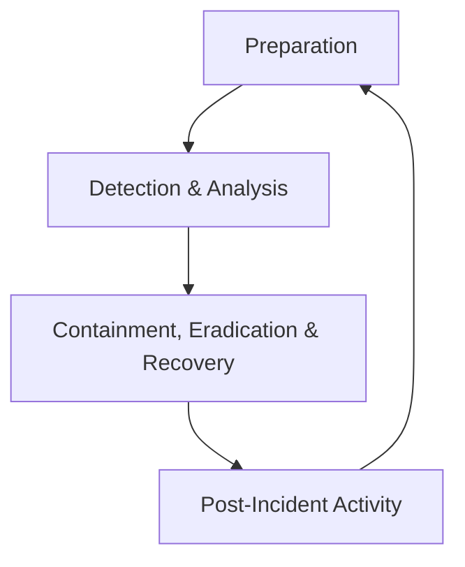
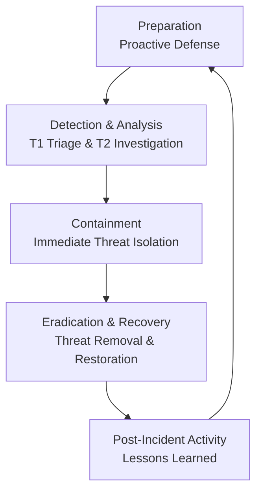
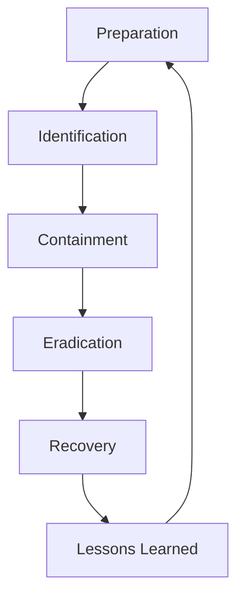

## What is the Security Incident Lifecycle?

The Security Incident Lifecycle is a structured process that defines the stages of managing a security incident from initial preparation through post-incident review. While various models exist with different numbers of phases, all share the same core concepts and continuous improvement philosophy.

## The Three Primary Models

### 1. NIST 4-Phase Model (The Industry Standard)

**The National Institute of Standards and Technology (NIST) SP 800-61 framework** is the authoritative standard used for compliance and strategic planning.

**Phase 1: Preparation**
- Developing IR plans and policies
- Building tooling and infrastructure
- Conducting training and exercises
- Establishing communication protocols

**Phase 2: Detection & Analysis**
- Monitoring and alerting
- Initial triage and investigation
- Incident validation and scoping
- Evidence collection

**Phase 3: Containment, Eradication & Recovery**
- Short-term and long-term containment
- Threat removal and root cause elimination
- System restoration and validation
- Business continuity execution

**Phase 4: Post-Incident Activity**
- Lessons learned review
- Incident documentation
- Process improvement
- Playbook updates

### 2. 5-Phase Model (The Operational Standard)

**Most companies use this practical 5-phase model** in their daily Security Operations Center (SOC) operations because it provides clearer operational separation.

**Phase 1: Preparation** 
*Identical to NIST Phase 1*
- **Developing IR Plans & Playbooks:** Creating the step-by-step guides you follow for different alert types.
- **Building Toolsets:** Implementing and configuring the SIEM, EDR, firewalls, and communication tools.
- **Training the Team:** Conducting tabletop exercises and security training.
- **Setting Up Communication Channels:** Defining who to call, when, and how.

**Phase 2: Detection & Analysis** 
*Identical to NIST Phase 2*
- **Detection:** An alert fires in the SIEM. (This is the start of your involvement).
- **Triage (T1):** You perform the initial investigation to answer: Is this real? What is the scope? What is the impact?
- **Deep-Dive Analysis (T2):** Confirming the incident, determining the root cause, and identifying all affected systems.
- **Evidence Collection:** Gathering logs, IOCs, and timelines.

**Phase 3: Containment**
*Split from NIST Phase 3*
- **Short-term Containment:** Immediate actions to prevent attack spread
  - Isolating a host from the network
  - Blocking malicious IP addresses at the firewall
  - Disabling compromised user accounts
- **Long-term Containment:** Temporary measures while preparing eradication
  - Applying temporary firewall rules
  - Implementing network segmentation
  - Restricting access permissions

**Phase 4: Eradication & Recovery**
*Split from NIST Phase 3*
- **Eradication:** Removing the root cause of the incident
  - Deleting malware and attacker tools
  - Patching exploited vulnerabilities
  - Removing threat actor persistence mechanisms
- **Recovery:** Restoring affected systems and services
  - Restoring data from clean backups
  - Rebuilding servers from golden images
  - Bringing contained systems back online after verification

**Phase 5: Post-Incident Activity**
*Identical to NIST Phase 4*
- **Lessons Learned Meeting:** Blameless review involving all stakeholders
- **Incident Report Documentation:** Formal documentation of timeline, impact, and actions
- **Process Improvement:** Updating playbooks and tuning detection rules

### 3. 6-Phase Model (High-Granularity Approach)

**Used by mature organizations** like Google and IBM for maximum process clarity and auditability.

**Phase 1: Preparation** 
*Identical to NIST Phase 1 and 5-Phase Model Phase 1*

**Phase 2: Identification** 
*Split from Detection & Analysis, focusing solely on initial recognition*
- Alert reception and initial assessment
- Incident logging and tracking
- Preliminary classification and prioritization

**Phase 3: Containment** 
*Identical to 5-Phase Model Phase 3*
- Immediate isolation actions
- Evidence preservation
- Damage limitation

**Phase 4: Eradication** 
*Standalone phase from 5-Phase Model*
- Complete threat removal
- Root cause elimination
- System hardening

**Phase 5: Recovery** 
*Standalone phase from 5-Phase Model*
- Controlled system restoration
- Service validation and testing
- Business process resumption

**Phase 6: Lessons Learned** 
*Renamed from Post-Incident Activity*
- Comprehensive retrospective analysis
- Metric collection and reporting
- Continuous improvement implementation

## SOC Tier Responsibilities Across All Models

| Phase | Primary T1 Role | Primary T2/T3 Role |
| :--- | :--- | :--- |
| **Preparation** | Learn tools & playbooks | Develop & improve playbooks |
| **Detection & Analysis** | **Initial Triage & Escalation** | Deep Dive, Scope, Confirm Incident |
| **Containment** | (Supporting role) | **Lead & Execute containment** |
| **Eradication** | (Not typically involved) | **Root cause analysis & removal** |
| **Recovery** | (Not typically involved) | System restoration & validation |
| **Post-Incident** | **Provide triage feedback** | Lead analysis, write reports, tune tools |

## Key Differences Summary

- **4-Phase (NIST):** Strategic framework combining containment, eradication, and recovery
- **5-Phase (Operational):** Practical separation of containment from eradication/recovery
- **6-Phase (Granular):** Maximum detail with separate identification, eradication, and recovery phases

## Why This Matters for SOC Analysts

As a T1 analyst, you'll primarily operate in the **Detection & Analysis** phase regardless of the model. However, understanding the complete lifecycle helps you:
- Appreciate the importance of accurate initial triage
- Understand what happens after you escalate an incident
- Contribute effectively to post-incident improvements
- Grow into T2/T3 roles that handle later phases

All models serve the same purpose: ensuring a systematic, effective approach to security incidents from start to finish.