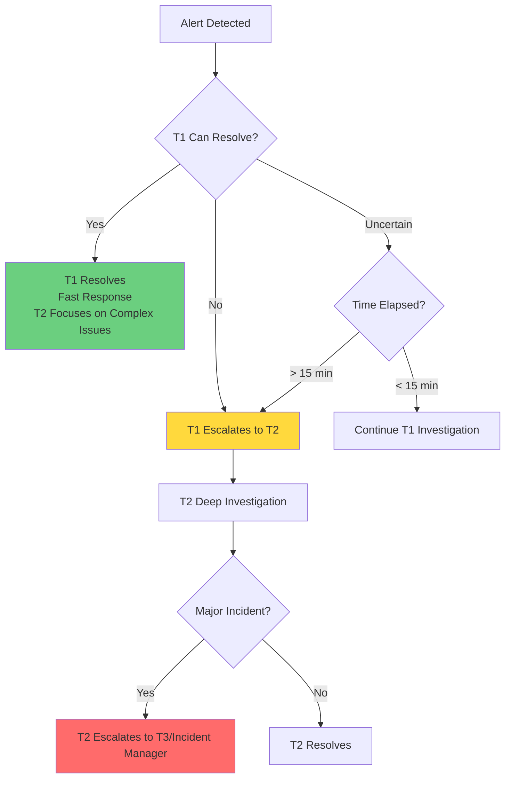
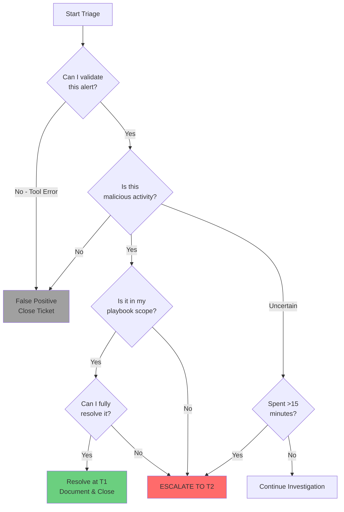
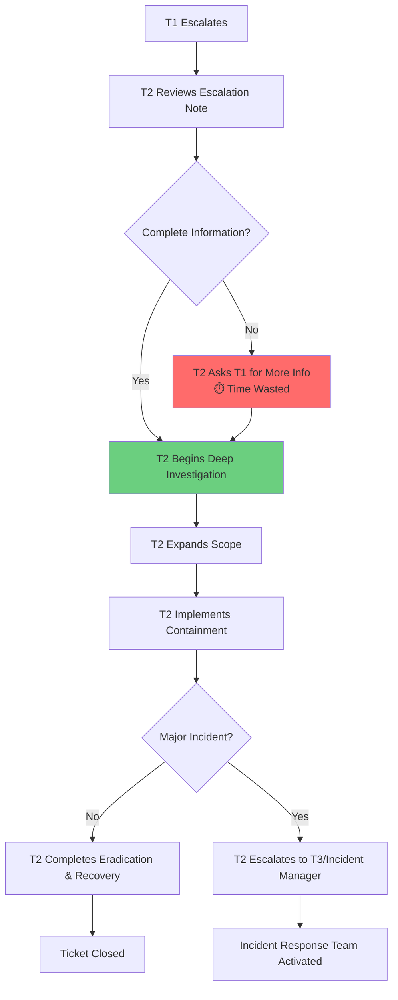

Escalation is the **single most important decision** a SOC Tier 1 analyst makes. Escalate too early, and you waste T2's time on issues you could have resolved. Escalate too late (or not at all), and a minor incident becomes a major breach. This course teaches you exactly when, how, and why to escalate.

---

### Why Escalation is Critical

mermaid



**The Balance:**

- **Escalate too often:** T2 spends time on issues you should handle → SOC inefficiency
- **Escalate too rarely:** Critical threats go undetected → Security breaches
- **Escalate correctly:** T1 filters noise, T2 focuses on real threats → Optimal SOC performance

---

### The Golden Rules of Escalation

#### Rule 1: When in Doubt, Escalate

**Always err on the side of escalation.** It's better to escalate an incident that turns out to be minor than to miss a critical threat because you weren't sure.

**Real Example:**

> You see unusual PowerShell activity but can't determine if it's malicious or a legitimate admin script. You've spent 15 minutes investigating.
> 
> **Correct Action:** Escalate to T2 with your findings. T2 can quickly determine if it's legitimate because they have more context about admin activities.
> 
> **Wrong Action:** Close as false positive because you "think" it's probably okay. (This is how breaches happen)

---

#### Rule 2: Follow Your Playbook's Escalation Criteria

Every alert type playbook has defined escalation triggers. **Trust the playbook** - it was built from lessons learned.

**Example Playbook Excerpt - Phishing Email Investigation:**

```
ESCALATION CRITERIA:
✓ If user clicked malicious link → ESCALATE (potential credential compromise)
✓ If user downloaded and opened attachment → ESCALATE (potential malware execution)
✓ If >10 users received same email → ESCALATE (coordinated campaign)
✓ If email contains zero-day exploit → IMMEDIATE P1 ESCALATION
✗ If user only received email but took no action → DO NOT ESCALATE (close as monitored)
```

---

#### Rule 3: Respect Your Time Limit

Most SOCs have a **15-20 minute rule** for T1 triage. If you can't make a confident decision in that timeframe, escalate.

**Why This Matters:**

- Spending 45 minutes on one alert means 3 other alerts aren't being triaged
- T2 analysts are better equipped for deep investigations
- Your job is **volume and velocity**, not deep forensics

---

### Escalation Decision Tree

Use this decision tree for EVERY alert:

mermaid



---

### When to Escalate: Specific Criteria

#### Category 1: Confirmed High-Severity Threats (ALWAYS ESCALATE)

These incidents always go to T2, no exceptions:

|Threat Type|Why Escalate|Example|
|---|---|---|
|**Malware with C2 Communication**|Indicates active attacker control|EDR detects beacon to known C2 server|
|**Ransomware Indicators**|Time-critical - spreads rapidly|File encryption activity detected|
|**Data Exfiltration**|Potential data breach, legal implications|Large upload to unknown external IP|
|**Lateral Movement**|Attacker moving through network|PSExec execution to multiple hosts|
|**Privilege Escalation**|Attacker gaining higher access|Standard user suddenly has admin rights|
|**Persistence Mechanisms**|Attacker establishing foothold|New scheduled task created by suspicious process|
|**Credential Theft**|Compromised accounts|Mimikatz or credential dumping detected|

**Real Example - Automatic Escalation:**

```
Alert: "Suspicious Process: mimikatz.exe Detected"
T1 Investigation:
- File hash confirmed as Mimikatz (credential theft tool)
- Process launched by user account: svc_backup
- Running on: SERVER-DC01 (Domain Controller)

T1 Decision: IMMEDIATE P1 ESCALATION - No further investigation needed
Reason: Credential dumping tool on domain controller = Critical threat
Escalation Time: 3 minutes from alert

Escalation Note: "CRITICAL: Mimikatz detected on domain controller. 
Immediate T2/T3 response required for credential reset and scope assessment."
```

---

#### Category 2: Technical Complexity Beyond T1 Scope

Escalate when investigation requires skills/tools beyond T1 capabilities:

|Situation|Why Escalate|Example|
|---|---|---|
|**Unknown/Suspicious Files**|Requires malware analysis|File not in VirusTotal, suspicious behavior but can't determine intent|
|**Complex Network Activity**|Requires advanced packet analysis|Unusual network protocol usage|
|**Encrypted/Obfuscated Code**|Requires reverse engineering|PowerShell with multiple layers of Base64 encoding|
|**Multi-Stage Attack**|Requires complete attack chain analysis|Multiple alerts across different systems that may be related|
|**Advanced Persistence**|Requires forensic tools|Registry/WMI persistence beyond basic checks|

**Real Example:**

```
Alert: "Suspicious PowerShell Execution"
T1 Investigation:
- Command line shows heavily obfuscated Base64 encoded command
- Multiple layers of encoding present
- VirusTotal shows 0/70 detection (too new or targeted)
- Process behavior unclear from EDR telemetry

T1 Decision: ESCALATE TO T2
Reason: Obfuscation complexity requires malware analysis skills
Investigation Time: 12 minutes

Escalation Note: "Multi-layer obfuscated PowerShell. Unable to determine 
intent at T1 level. Sample available for T2 analysis. Host not isolated 
pending T2 direction."
```

---

#### Category 3: Scope Expansion Required

Escalate when you identify an indicator that needs to be searched enterprise-wide:

|Situation|Why Escalate|T2 Action Needed|
|---|---|---|
|**IOC on Multiple Hosts**|Single T1 can't investigate all|Hunt for IOC across all systems|
|**Compromised High-Value User**|Requires access review|Audit all user activity, check for unauthorized access|
|**Widespread Campaign**|Organizational coordination needed|Email deletion, user notification, metrics|
|**Infrastructure Compromise**|Affects multiple teams|Coordinate with IT, review backup integrity|

**Real Example:**

```
Alert: "Phishing Email Received by User"
T1 Investigation:
- Confirmed malicious link (credential harvesting site)
- Checked if recipient clicked: YES - user entered credentials
- SIEM query shows email sent to 150 users
- 12 users clicked the link so far

T1 Decision: ESCALATE TO T2 (Priority: P1)
Reason: Campaign affecting multiple users, requires coordinated response
Investigation Time: 10 minutes

Escalation Note: "Phishing campaign - 150 recipients, 12 confirmed clicks. 
Need T2 for:
1. Enterprise-wide email deletion
2. Password reset for affected users  
3. Check for unauthorized access using stolen credentials
4. User notification campaign

Compromised users: [list of 12 usernames]
Malicious URL: hxxp://fake-company-login[.]com"
```

---

#### Category 4: Policy/Authority Limitations

Escalate when resolution requires actions outside your authority:

|Action Required|Why T1 Can't Do It|T2/T3 Authority|
|---|---|---|
|**Disable Executive Accounts**|Requires management approval|T2 can coordinate with management|
|**Network Isolation of Critical Servers**|Business impact assessment needed|T3 makes business continuity decisions|
|**Evidence Preservation for Legal**|Requires legal coordination|T3 works with legal team|
|**Third-Party Vendor Coordination**|Requires vendor relationships|T2/T3 has vendor contacts|

**Real Example:**

```
Alert: "Multiple Failed Login Attempts - Executive Account"
T1 Investigation:
- Account: CEO (john.ceo@company.com)
- 200 failed login attempts from IP in China
- No successful logins detected
- Account currently active

T1 Decision: ESCALATE TO T2
Reason: Executive account - requires management coordination for disabling
Investigation Time: 8 minutes

Escalation Note: "CEO account under brute force attack. Recommend immediate 
password reset and MFA enforcement. Escalating due to executive status - 
requires management notification before account action."
```

---

### How to Escalate: The Perfect Handoff

#### The Escalation Note Template

Use this template for every escalation to ensure T2 has everything they need:

```
ESCALATION TO T2 - [BRIEF INCIDENT DESCRIPTION]

Priority: [P1/P2/P3]
Affected User: [username] ([department/role - if relevant])
Affected System: [hostname] (IP: [address])

INCIDENT SUMMARY:
[2-3 sentence summary of what happened]

IOCs IDENTIFIED:
- File Hash: [SHA256 if applicable]
- IP Addresses: [list]
- Domains: [list]
- File Paths: [list]
- User Accounts: [list]
- Process Names: [list]

TIMELINE:
[HH:MM UTC] - [Event]
[HH:MM UTC] - [Event]

ACTIONS TAKEN BY T1:
1. [HH:MM UTC] - [Action and result]
2. [HH:MM UTC] - [Action and result]
3. [HH:MM UTC] - [Action and result]

CURRENT STATUS:
- Host Status: [Isolated/Online/Monitoring]
- User Account Status: [Active/Disabled]
- Threat Status: [Contained/Active/Unknown]

WHY ESCALATING:
[Specific reason T2 involvement is needed - reference criteria categories]

RECOMMENDED T2 ACTIONS:
1. [Specific action]
2. [Specific action]

URGENCY NOTES:
[Any time-sensitive information or special circumstances]

T1 Analyst: [Your Name]
Escalation Time: [HH:MM UTC]
T1 Investigation Duration: [X minutes]
```

---

#### Real-World Escalation Example - PERFECT

```
ESCALATION TO T2 - CONFIRMED MALWARE WITH LATERAL MOVEMENT ATTEMPT

Priority: P1 - Critical
Affected User: jsmith (Finance Department - Domain Admin)
Affected System: DESKTOP-FIN-042 (IP: 10.50.100.87)

INCIDENT SUMMARY:
EDR detected TrickBot malware with active C2 communication. User has domain 
admin privileges. Evidence of reconnaissance and attempted lateral movement 
to file server detected.

IOCs IDENTIFIED:
- File Hash (SHA256): 7b2a9f8e3c1d4e5f6a7b8c9d0e1f2a3b4c5d6e7f8a9b0c1d2e3f4a5b6c7d8e9f0
- File Path: C:\Users\jsmith\AppData\Roaming\Windows\svchost.exe
- C2 IP: 198.51.100.45:443 (ThreatFox confirmed TrickBot C2)
- C2 Domain: updates-cdn[.]com
- Process: Suspicious svchost.exe (not in System32)
- Network Activity: SMB scans to 10.50.200.0/24 network (file server subnet)

TIMELINE:
14:22 UTC - Initial malware execution detected
14:25 UTC - C2 communication established  
14:30 UTC - Network reconnaissance began (SMB scanning)
14:35 UTC - EDR alert generated
14:38 UTC - T1 investigation started
14:42 UTC - Host isolated via EDR
14:45 UTC - User account jsmith disabled in AD
14:50 UTC - Escalation initiated

ACTIONS TAKEN BY T1:
1. 14:38 UTC - Verified hash via VirusTotal (58/70 engines flagged as TrickBot)
2. 14:40 UTC - Checked ThreatFox - confirmed C2 infrastructure
3. 14:42 UTC - Isolated host via EDR (confirmed successful)
4. 14:43 UTC - Reviewed EDR process tree - identified parent process (Outlook.exe - likely phishing vector)
5. 14:45 UTC - Disabled AD account jsmith (confirmed in AD)
6. 14:46 UTC - Checked firewall logs - confirmed outbound connections to C2
7. 14:48 UTC - Queried SIEM for other hosts contacting C2 IP - 0 results (scope limited to this host so far)

CURRENT STATUS:
- Host Status: ISOLATED via EDR
- User Account Status: DISABLED in AD
- Threat Status: CONTAINED but C2 communication occurred for ~20 minutes

WHY ESCALATING:
1. Domain admin account compromised - HIGH RISK for lateral movement
2. Active C2 communication indicates potential data exfiltration
3. Network reconnaissance detected - attacker was actively scanning for targets
4. Requires enterprise-wide IOC hunting (beyond T1 scope)
5. Requires forensic analysis to determine what data was accessed/exfiltrated
6. Need credential reset coordination for potentially compromised admin access

RECOMMENDED T2 ACTIONS:
1. Enterprise-wide hunt for C2 IP (198.51.100.45) in last 7 days
2. Review all domain admin activity by jsmith in last 48 hours
3. Memory forensics on isolated host for credential extraction attempts
4. Assess lateral movement success - check file server logs for jsmith access
5. Coordinate domain admin credential reset with IT leadership
6. Forensic image of host for potential legal/compliance requirements

URGENCY NOTES:
User jsmith has domain admin access to production file servers containing 
financial data. C2 communication window of 20 minutes is sufficient for 
credential theft and lateral movement prep. Recommend immediate T3 
notification for potential major incident declaration.

T1 Analyst: Sarah Chen
Escalation Time: 14:50 UTC
T1 Investigation Duration: 12 minutes
```

---

### Escalation Communication Protocols

#### Who to Escalate To

|Situation|Escalate To|When|
|---|---|---|
|**Normal True Positive**|Next available T2 in queue|Standard escalation process|
|**P1 Critical Incident**|T2 Team Lead + Notify SOC Manager|Immediate escalation|
|**After-Hours P1**|On-Call T2 (via pager/phone)|Outside business hours|
|**Executive User Affected**|T2 + CC SOC Manager|Any priority level|
|**Potential Data Breach**|T2 + Notify Incident Manager|Immediate escalation|

**Example Escalation Path:**

```
Standard Business Hours (8am-6pm):
T1 → T2 Queue → T2 Analyst picks up ticket

After Hours (6pm-8am):
T1 → Assign to On-Call T2 + Page via PagerDuty

Critical P1 Anytime:
T1 → Assign to T2 Team Lead + Send Slack alert to #soc-critical + 
     Email SOC Manager
```

---

#### Escalation SLAs (Service Level Agreements)

Know your organization's expected response times:

|Priority|T1 → T2 Escalation SLA|T2 Acknowledgment SLA|Example|
|---|---|---|---|
|**P1 - Critical**|Immediate (< 5 min)|Immediate (< 10 min)|Ransomware, active breach|
|**P2 - High**|< 30 minutes|< 1 hour|Confirmed malware, compromised account|
|**P3 - Medium**|< 2 hours|< 4 hours|Suspicious activity, policy violation|
|**P4 - Low**|< 1 business day|< 1 business day|Informational, low-risk findings|

**Why This Matters:** If T2 hasn't acknowledged your P1 escalation in 10 minutes, you should **follow up** via Slack/Teams/Phone to ensure they saw it.

---

### Common Escalation Mistakes to Avoid

#### Mistake 1: Escalating Without Investigation

❌ **Wrong:**

```
Escalation Note: "Got an alert for suspicious PowerShell. Please investigate."
Actions Taken: None
```

✅ **Right:**

```
Escalation Note: "Obfuscated PowerShell with Base64 encoding detected. Performed 
initial checks - VirusTotal clean, but encoding pattern matches known malware 
techniques. Need T2 malware analysis."

Actions Taken:
1. Checked VirusTotal - 0/70 detection
2. Reviewed command line - multiple encoding layers present
3. Checked process parent - launched by user jsmith via Excel
4. Checked user jsmith - standard user, Finance department
```

**Why It Matters:** T1's job is to triage, not to immediately escalate every alert. Do your initial investigation first.

---

#### Mistake 2: Missing Critical Context

❌ **Wrong:**

```
Escalation Note: "Found malware. Host isolated."
IOCs: 10.50.100.25
```

✅ **Right:**

```
Escalation Note: "TrickBot malware detected on Finance user's machine with domain 
admin privileges. Host isolated, account disabled. Need scope assessment."

IOCs:
- Host: DESKTOP-FIN-042 (10.50.100.25)
- User: jsmith (Domain Admin - HIGH RISK)
- File Hash: 7b2a9f8e... (TrickBot confirmed)
- C2 IP: 198.51.100.45
- C2 Duration: ~20 minutes before isolation
```

**Why It Matters:** "Domain admin with malware" is exponentially more severe than "user with malware". Context changes T2's response priority.

---

#### Mistake 3: Not Following Up

❌ **Wrong:** Escalate a P1, then go to lunch without confirming T2 acknowledged it.

✅ **Right:** Escalate P1, wait 5 minutes, check if T2 acknowledged. If not, send Slack message: "Hey @T2-team, just escalated critical ticket #12345 - ransomware on file server. Please confirm you see it."

**Why It Matters:** Escalating isn't enough - you must ensure the handoff was successful, especially for critical incidents.

---

#### Mistake 4: Over-Escalating False Positives

❌ **Wrong Pattern:**

- Alert: "User accessed file after hours"
- Your thought: "I'm not 100% sure this is okay"
- Action: Escalate every after-hours file access

Result: T2 gets flooded with false positive escalations, loses trust in your judgment

✅ **Right Pattern:**

- Alert: "User accessed file after hours"
- Your investigation:
    - Check if user commonly works after hours - YES (IT team, on-call schedule)
    - Check what file accessed - Normal work file, not sensitive
    - Check access pattern - Consistent with user's normal behavior
- Action: Close as false positive with clear documentation

**When to escalate "uncertain" cases:** If there's a realistic security risk, not just because you're unsure of normal behavior.

---

### What Happens After You Escalate

Understanding T2's process helps you improve your escalations:

mermaid



**T2's Perspective on Your Escalation:**

|What T2 Looks for First|Good Escalation Provides|Poor Escalation Lacks|
|---|---|---|
|**Is this urgent?**|Clear priority level with justification|Vague or incorrect priority|
|**What's affected?**|Specific hostnames, IPs, user accounts|Generic "one computer" description|
|**What did T1 already check?**|Chronological action list|No documentation of T1 investigation|
|**What evidence exists?**|Structured IOC list|"Found some bad stuff"|
|**What containment occurred?**|Current status (isolated/disabled/monitoring)|No mention of containment actions|
|**Why do they need me?**|Specific escalation reason|"Not sure what to do"|

---

### Practice Scenarios: Should You Escalate?

Test your escalation judgment with these scenarios:

#### Scenario 1: Unusual Login Time

```
Alert: "User Login Outside Normal Hours"
Details:
- User: jsmith (Marketing Analyst)
- Login Time: 2:47 AM local time
- User's normal hours: 9 AM - 5 PM
- Location: Same office IP as usual
- No failed login attempts
- User accessed email and marketing reports

Should you escalate?
```

<details> <summary><strong>Answer & Reasoning</strong></summary>

**Decision: DO NOT ESCALATE** - Close as False Positive

**Investigation Steps:**

1. Check user's calendar - Working on time-sensitive campaign with 3 AM deadline
2. Verify IP address - Matches user's usual office IP
3. Check activity - Accessed only work-related files
4. Review pattern - User has worked late before on campaign deadlines

**Resolution:** Legitimate after-hours work. Document findings and close.

**When to escalate this type:** If login was from unusual location, multiple failed attempts first, or access to sensitive data outside user's normal scope.

</details>

---

#### Scenario 2: Suspicious File Download

```
Alert: "Executable Downloaded from Internet"
Details:
- User: admin_helpdesk (IT Support)
- File: AdvancedIPScanner.exe
- Source: https://www.advanced-ip-scanner.com
- VirusTotal: 3/70 engines flagged (low confidence)
- User role: Legitimate IT admin who troubleshoots network issues

Should you escalate?
```

<details> <summary><strong>Answer & Reasoning</strong></summary>

**Decision: DO NOT ESCALATE** - Close as False Positive

**Investigation Steps:**

1. Check if tool is legitimate - Advanced IP Scanner is a legitimate network diagnostic tool
2. Verify download source - Official website, not a suspicious domain
3. Check user role - IT admin with legitimate need for network tools
4. Review VirusTotal false positive pattern - Network scanning tools often flagged by AV
5. Verify with IT manager (if uncertain) - Confirm this is an approved tool

**Resolution:** Legitimate IT tool downloaded by authorized personnel. Document as approved activity.

**When to escalate this type:** If user is NOT IT staff, if downloaded from suspicious domain, if file hash doesn't match official version, or if tool is used for malicious purposes (detected scanning activity).

</details>

---

#### Scenario 3: Multiple Failed Logins

```
Alert: "Brute Force Attempt Detected"
Details:
- Target Account: admin_backup (Service Account)
- Failed Attempts: 1,247 in 3 minutes
- Source IP: 45.76.132.89 (Russia)
- ThreatFox: IP flagged as brute force source
- Successful Login: YES, on attempt 1,248
- Current Activity: Accessing file shares, downloading files

Should you escalate?
```

<details> <summary><strong>Answer & Reasoning</strong></summary>

**Decision: IMMEDIATE P1 ESCALATION**

**Why This is Critical:**

- Service account compromised (these often have elevated privileges)
- Successful authentication after brute force = confirmed compromise
- Active data access = potential data exfiltration in progress
- Foreign IP address with known malicious reputation

**Immediate Actions Before Escalation:**

1. Disable account admin_backup in AD
2. Check if host can be isolated (if service account is used for specific host)
3. Query SIEM for all admin_backup activity in last 24 hours
4. Block source IP 45.76.132.89 at firewall

**Escalation Note Focus:** "SERVICE ACCOUNT COMPROMISE - Successful brute force followed by file share access. Account disabled. Need immediate scope assessment of data accessed and credential reset coordination."

**This hits escalation criteria:**

- ✓ Confirmed compromise (not just attempt)
- ✓ Active threat (currently downloading files)
- ✓ Service account (high privilege risk)
- ✓ Potential data breach

</details>

---

#### Scenario 4: Antivirus Detection

```
Alert: "Malware Detected and Quarantined"
Details:
- File: document.pdf.exe
- Detection: Trojan.Generic
- Action: File quarantined automatically by AV
- User: jdoe (Sales)
- Execution Status: File quarantined BEFORE execution
- Source: Email attachment
- VirusTotal: 45/70 engines flagged

Should you escalate?
```

<details> <summary><strong>Answer & Reasoning</strong></summary>

**Decision: DO NOT ESCALATE** - Resolve at T1 Level

**Why This Can Be Resolved at T1:**

- Malware was quarantined BEFORE execution (no compromise occurred)
- Standard detection by AV (not sophisticated evasion)
- Clear single-host incident (no lateral movement risk)
- Standard response procedure available in playbook

**T1 Resolution Actions:**

1. Verify quarantine successful - CHECK EDR/AV console
2. Confirm file was NOT executed - Check process logs
3. Delete phishing email from user mailbox - Use email gateway
4. Run full system scan - Verify no additional threats
5. Security awareness reminder to user - Email about phishing recognition
6. Document IOCs for threat intelligence - Submit hash to internal TI feed

**Resolution Note:** "Malware quarantined before execution. No compromise occurred. Phishing email source identified and removed. User educated on phishing recognition. System scan clean."

**When to escalate this type:** If file executed before quarantine, if AV failed to detect it initially (found through investigation), if multiple users affected, or if sophisticated malware with potential AV evasion.

</details>

---

#### Scenario 5: Unusual PowerShell Activity

```
Alert: "Suspicious PowerShell Execution"
Details:
- Command: powershell.exe -encodedcommand [long base64 string]
- User: SYSTEM
- Parent Process: w3wp.exe (IIS web server)
- Host: WEB-SERVER-03 (public-facing website)
- Encoding: Multiple layers of obfuscation
- VirusTotal: 0/70 (too new/targeted)

Should you escalate?
```

<details> <summary><strong>Answer & Reasoning</strong></summary>

**Decision: IMMEDIATE P1 ESCALATION**

**Why This is Critical:**

- Web server executing encoded PowerShell = likely web shell / RCE (Remote Code Execution)
- Running as SYSTEM = full server compromise
- Public-facing server = attacker has remote access
- Obfuscated command = malicious intent
- Zero AV detection = potentially targeted attack

**Immediate Actions Before Escalation:**

1. DO NOT isolate yet (need to preserve evidence of attack method)
2. Take network packet capture if possible
3. Check IIS logs for suspicious requests leading to this execution
4. Query SIEM for other web servers with similar PowerShell activity
5. Alert T2 via Slack/phone immediately (don't wait for ticket)

**Escalation Note Focus:** "CRITICAL - Web shell suspected on public web server. Encoded PowerShell executed by IIS. Likely RCE exploit. Need immediate T2 forensics and containment strategy. DO NOT isolate yet - coordinated response needed."

**This hits multiple escalation criteria:**

- ✓ Critical infrastructure compromised
- ✓ Technical complexity (requires malware analysis)
- ✓ Potential scope expansion (check other web servers)
- ✓ Active attacker with remote access
- ✓ Public-facing asset (high business impact)

</details>

---

## Escalation Checklist

Use this checklist before every escalation:

### Pre-Escalation Verification

- [ ]  **Investigation Complete**: I've followed the playbook steps for this alert type
- [ ]  **Time Check**: I've spent < 20 minutes on triage (or hit investigation limit)
- [ ]  **Evidence Gathered**: I have all IOCs (IPs, hashes, domains, file paths, user accounts)
- [ ]  **Actions Documented**: I've recorded all investigation steps chronologically
- [ ]  **Containment Executed**: I've taken appropriate T1-level containment actions (if applicable)
- [ ]  **Priority Assigned**: I've set the correct P1/P2/P3 based on impact
- [ ]  **Escalation Reason Clear**: I can explain in one sentence why T2 is needed

### Escalation Note Quality Check

- [ ]  **Summary**: Clear 2-3 sentence incident description
- [ ]  **IOCs**: Structured list of all indicators found
- [ ]  **Timeline**: Key events in chronological order with timestamps
- [ ]  **Actions Taken**: Complete list of what I checked and did
- [ ]  **Current Status**: Host status, account status, threat status
- [ ]  **Why Escalating**: Specific reason referencing escalation criteria
- [ ]  **Recommendations**: Suggested T2 actions (if applicable)
- [ ]  **Urgency Notes**: Any time-sensitive information

### Post-Escalation Actions

- [ ]  **Confirmation**: T2 acknowledged the ticket (especially for P1/P2)
- [ ]  **Availability**: I'm available for questions if T2 needs clarification
- [ ]  **Monitoring**: I'm watching for related alerts while T2 investigates
- [ ]  **Learning**: I'll review T2's investigation notes to improve my skills

---

## Escalation Metrics: How You're Measured

Understanding how your escalations are measured helps you improve:

|Metric|What It Measures|Goal|How to Improve|
|---|---|---|---|
|**Escalation Rate**|% of your tickets escalated|15-30% (varies by SOC)|Better triage skills, playbook mastery|
|**Escalation Accuracy**|% of escalations that were truly necessary|>90%|Don't over-escalate false positives|
|**Escalation Quality**|T2 rating of your escalation notes|>4/5 average|Complete documentation, clear reasoning|
|**T2 Follow-Up Rate**|% of escalations where T2 asks for more info|<10%|Include all necessary information upfront|
|**Time to Escalate**|How fast you escalate critical incidents|P1: <15 min, P2: <30 min|Recognize critical patterns faster|

**What "Good" Looks Like:**

- 20-25% escalation rate (filtering out most false positives, escalating real threats)
- 95% escalation accuracy (T2 agrees with your assessment)
- 4.5/5 average quality score from T2
- 5% follow-up rate (T2 rarely needs to ask you for more info)

**Red Flags:**

- <10% escalation rate = Under-escalating, missing real threats
- > 40% escalation rate = Over-escalating, not doing enough T1 investigation
    
- <80% accuracy = Escalating too many false positives
- > 20% follow-up rate = Incomplete escalation notes
    

---

## Real-World Escalation Patterns

Learn from these common patterns:

### Pattern 1: "The Cascade"

**Situation:** Single indicator snowballs into major incident

```
Initial Alert: "Suspicious Email Attachment"
↓
T1 Investigation: User downloaded and opened attachment
↓
T1 Escalation: Potential malware execution
↓
T2 Investigation: Confirms malware, discovers C2 communication
↓
T2 Escalation: Lateral movement detected, 5 hosts compromised
↓
T3 Response: Major incident declared, full IR team activated
```

**Lesson:** Even a "simple" phishing alert can be the tip of the iceberg. Thorough T1 investigation and fast escalation is critical.

---

### Pattern 2: "The False Alarm Spiral"

**Situation:** Over-escalating creates escalation fatigue

```
Week 1: T1 escalates 15 "suspicious" PowerShell alerts → All false positives
Week 2: T2 starts ignoring T1's escalations
Week 3: T1 escalates real malware → T2 delays response (thinks it's another FP)
Week 4: Real malware spreads because of delayed response
```

**Lesson:** Over-escalation is as dangerous as under-escalation. Do your investigation before escalating.

---

### Pattern 3: "The Perfect Handoff"

**Situation:** T1 escalation enables instant T2 response

```
14:35 UTC - Alert fires
14:38 UTC - T1 starts investigation
14:45 UTC - T1 completes thorough triage, documents everything
14:47 UTC - T1 escalates with complete IOCs and context
14:50 UTC - T2 picks up ticket
14:52 UTC - T2 begins deep investigation (no questions for T1 needed)
15:15 UTC - T2 completes scope expansion and containment
```

**Lesson:** 10 minutes of thorough T1 documentation saves 30 minutes of T2 time.

---

## Action Plan: Master Escalation

|Action Item|Description|Why It's Important|
|---|---|---|
|**1. Create Your Escalation Template**|Build a reusable template with all required fields. Store it in your notes for quick copy/paste.|Ensures you never forget critical information when escalating under pressure during a P1 incident.|
|**2. Review 15 Past Escalations**|Read 15 tickets that were escalated in the past month. 5 excellent, 5 average, 5 poor quality. Identify what made them different.|Real examples teach you what great escalations look like and common mistakes to avoid.|
|**3. Get T2 Feedback**|Ask a T2 analyst to review your last 3 escalations and provide honest feedback. "What did I do well? What could I improve?"|Direct feedback from the person receiving your escalations is the fastest way to improve.|
|**4. Practice Scenarios Weekly**|Every week, take one past alert and practice writing an escalation note (even if it didn't need escalation). Time yourself.|Builds muscle memory for fast, complete escalations during real incidents.|
|**5. Track Your Metrics**|At the end of each month, calculate: How many tickets did I work? How many did I escalate? What % did T2 agree with?|Self-awareness of your patterns helps you improve before management feedback.|
|**6. Shadow T2 Investigations**|After you escalate, ask to observe the T2 investigation (when possible). See what they do with your information.|Understanding T2's workflow shows you what information they value most.|
|**7. Build an IOC Collection Habit**|For every investigation (escalated or not), practice documenting all IOCs in a structured format.|Makes this automatic so you don't forget IOCs during high-pressure escalations.|

---

## Common Questions About Escalation

### Q1: "What if I'm not sure if something is malicious?"

**A:** If you've spent 15 minutes investigating and still can't determine if it's malicious, escalate. Include in your note: "Unable to determine malicious intent at T1 level. Suspicious indicators include: [list them]. Need T2 analysis."

### Q2: "What if T2 disagrees with my escalation?"

**A:** This is normal and part of learning. Ask for feedback: "Can you help me understand what I should have checked to determine this was a false positive?" Most T2 analysts are happy to mentor.

### Q3: "Should I escalate if the threat is already contained?"

**A:** Yes, if it meets escalation criteria. Even if you've isolated a host and disabled an account, T2 needs to do scope expansion (hunt for the IOC elsewhere) and root cause analysis (how did it happen?).

### Q4: "What if multiple alerts are related?"

**A:** Create one escalation ticket that references all related alerts. Link them together and explain the relationship: "Three alerts (Ticket #101, #102, #103) appear to be part of the same attack chain. Escalating as single incident."

### Q5: "Can I escalate to T3 directly?"

**A:** No (in most SOCs). The escalation path is T1 → T2 → T3. Exception: If T2 is completely unavailable during an active P1 incident and you've tried all contact methods, then escalate to T3 and explain the situation.

### Q6: "What if I escalated something that turned out to be false positive?"

**A:** This will happen occasionally and it's okay. What matters is:

1. Did you do proper investigation before escalating?
2. Did you document your reasoning?
3. Are you learning from T2's feedback?

If yes to all three, you're doing fine. An occasional false positive escalation is better than missing a real threat.

### Q7: "How do I escalate when I'm unsure which priority to assign?"

**A:** When in doubt between two priorities, choose the higher one and explain your reasoning: "Assigning P1 due to domain admin account involvement, but may be P2 if activity is determined to be legitimate admin work. Need T2 assessment."

---

> **T1 Analyst Goal:** Master the art of escalation by understanding WHEN (criteria), HOW (documentation), and WHY (impact) to escalate. Your escalation decisions are the gateway between noise and real threats - get this right and you become an invaluable asset to your SOC team.

---

## Quick Reference: Escalation Decision Matrix

Print this and keep it at your desk:

|If You See...|Escalate?|Priority|Immediate Actions|
|---|---|---|---|
|Malware with C2 communication|✅ YES|P1|Isolate host, disable account, gather IOCs|
|Ransomware indicators|✅ YES|P1|DO NOT isolate yet, alert T2 via phone/Slack|
|Credential dumping tools|✅ YES|P1|Isolate host, gather IOCs, note affected accounts|
|Phishing email, user clicked, entered creds|✅ YES|P2|Disable account, check for unauthorized access|
|Suspicious file, can't determine intent after 15 min|✅ YES|P2|Document findings, preserve file sample|
|Multiple related alerts across systems|✅ YES|P2|Link alerts, note timeline, identify pattern|
|Brute force with successful login|✅ YES|P2|Disable account, check for unauthorized activity|
|Executive/high-value user affected|✅ YES|P2|Follow standard process, notify management|
|Malware quarantined BEFORE execution|❌ NO|-|Verify quarantine, full scan, educate user, close ticket|
|After-hours login from usual location|❌ NO|-|Verify legitimacy, document, close ticket|
|IT admin downloading legitimate tools|❌ NO|-|Verify tool legitimacy and user authority, close ticket|
|Alert on known false positive pattern|❌ NO|-|Document as FP, recommend rule tuning, close ticket|
