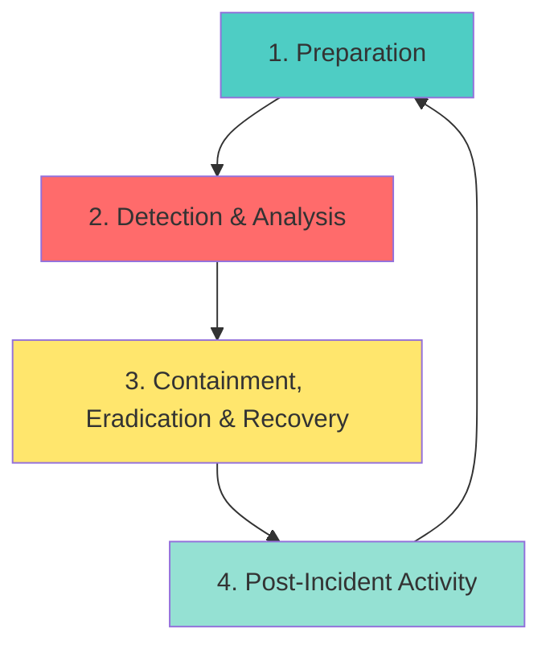
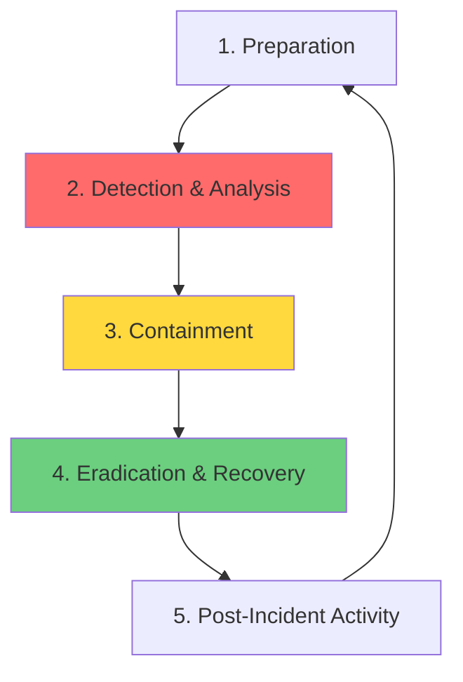
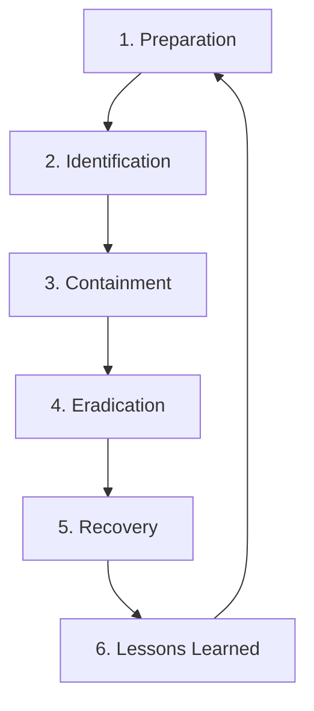

The Security Incident Lifecycle is a structured process that defines the stages of managing a security incident from initial preparation through post-incident review. Understanding this lifecycle helps you appreciate where your T1 role fits and what happens after you escalate an incident.

---

### The Three Primary Models

Organizations use different models, but all share the same core concepts. As a T1 analyst, you'll primarily work in the **Detection & Analysis** phase regardless of which model your organization uses.

---

### Model 1: NIST 4-Phase Model (The Industry Standard)

**The National Institute of Standards and Technology (NIST) SP 800-61 framework** is the authoritative standard used for compliance and strategic planning.

mermaid

#### Phase 1: Preparation

**What Happens:**

- Developing IR plans, policies, and playbooks
- Building and configuring security tooling (SIEM, EDR, IDS/IPS)
- Conducting training, tabletop exercises, and simulations
- Establishing communication protocols and contact lists

**Your T1 Role:** Learn the tools, study the playbooks, participate in training exercises

**Real Example:** Your SOC runs a monthly tabletop exercise simulating a ransomware attack. You practice your triage steps and escalation procedures before a real incident occurs.

---

#### Phase 2: Detection & Analysis

**What Happens:**

- Monitoring systems generate alerts
- **T1 performs initial triage** (Is this real? What's the scope?)
- T2 performs deep-dive investigation
- Evidence collection and IOC identification
- Incident validation and impact assessment

**Your T1 Role:** **THIS IS YOUR PRIMARY PHASE** - You are the first responder. Your speed and accuracy here determine how fast the organization can respond to threats.

**Real Example:** SIEM alert fires for "Suspicious PowerShell Execution". You check the command line, verify it's not a legitimate admin script, identify the user and host affected, and escalate to T2 with your findings in 15 minutes instead of 2 hours.

---

#### Phase 3: Containment, Eradication & Recovery

**What Happens:**

- **Containment:** Immediate actions to stop attack spread (isolate hosts, block IPs, disable accounts)
- **Eradication:** Remove the root cause (delete malware, patch vulnerabilities, remove persistence)
- **Recovery:** Restore affected systems (rebuild from clean backups, restore services, verify systems clean)

**Your T1 Role:** Supporting role - you may be asked to execute specific containment actions directed by T2/T3

**Real Example:** T2 asks you to isolate three specific hosts via EDR while they continue investigating the full scope. You execute the isolation, document the action in tickets, and confirm completion.

---

#### Phase 4: Post-Incident Activity

**What Happens:**

- Lessons learned meeting (blameless review with all stakeholders)
- Formal incident report documentation
- Process improvements and playbook updates
- Detection rule tuning to prevent recurrence

**Your T1 Role:** Provide feedback on what worked and what didn't during triage. Your input helps improve playbooks and detection rules.

**Real Example:** In the post-incident review, you mention that the alert description was unclear, which slowed your triage. T3 updates the alert rule to include more context, making future triage faster.

---

### Model 2: 5-Phase Model (The Operational Standard)

**Most companies use this practical 5-phase model** in daily SOC operations because it provides clearer operational separation between containment and eradication/recovery.

mermaid

**Key Difference from NIST:** Phase 3 (Containment) is separated from Phase 4 (Eradication & Recovery), making it clearer when to focus on stopping the attack versus cleaning up and restoring.

#### Phase 3: Containment (Split from NIST Phase 3)

**Short-term Containment:** Immediate actions to prevent attack spread

- Isolating a compromised host from the network
- Blocking malicious IP addresses at the firewall
- Disabling compromised user accounts
- Quarantining malicious files

**Long-term Containment:** Temporary measures while preparing for eradication

- Applying temporary firewall rules
- Implementing network segmentation
- Restricting access permissions
- Deploying temporary monitoring

**Real Example:** Ransomware detected on one workstation. **Short-term:** Immediately isolate the host to prevent spread to file servers. **Long-term:** Segment the entire department's network while investigating other potentially infected machines.

---

#### Phase 4: Eradication & Recovery (Split from NIST Phase 3)

**Eradication:** Removing the root cause

- Deleting malware and attacker tools
- Patching exploited vulnerabilities
- Removing persistence mechanisms (scheduled tasks, registry keys, backdoor accounts)
- Closing attack vectors

**Recovery:** Restoring normal operations

- Restoring data from verified clean backups
- Rebuilding compromised servers from golden images
- Bringing contained systems back online after verification
- Monitoring restored systems for reinfection

**Real Example:** After containing the ransomware, T2 identifies the initial access was via an unpatched VPN server. **Eradication:** Patch the VPN, remove malware artifacts. **Recovery:** Restore encrypted files from backups, verify systems clean, restore network access.

---

### Model 3: 6-Phase Model (High-Granularity Approach)

**Used by mature organizations** like Google and IBM for maximum process clarity and auditability.

mermaid

**Key Difference:** Separates Detection & Analysis into **Identification** (recognizing the incident) and moves eradication and recovery into fully separate phases for detailed tracking.

**When This Model Matters:** In highly regulated industries (finance, healthcare) where detailed audit trails and phase-by-phase sign-offs are required.

---

## Model Comparison Table

|Aspect|4-Phase (NIST)|5-Phase (Operational)|6-Phase (Granular)|
|---|---|---|---|
|**Primary Use**|Compliance & Strategy|Daily SOC Operations|Audit & Mature SOCs|
|**Detection Phase**|Detection & Analysis|Detection & Analysis|Identification|
|**Containment**|Combined with Eradication/Recovery|Separate Phase|Separate Phase|
|**Eradication**|Combined with Containment/Recovery|Combined with Recovery|Separate Phase|
|**Recovery**|Combined with Containment/Eradication|Combined with Eradication|Separate Phase|
|**Best For**|Framework alignment|Fast-moving SOC teams|Detailed audit requirements|

---

## Why This Matters for Your T1 Career

### 1. Context for Your Daily Work

Understanding the full lifecycle shows you that your triage work in **Detection & Analysis** is the critical first step that determines response speed for all subsequent phases.

### 2. Communication with Other Teams

When you escalate to T2, you're handing off from Detection/Analysis to Containment. Knowing this helps you understand what information T2 needs from you.

### 3. Career Growth Path

- **T1:** Focus on Detection & Analysis
- **T2:** Lead Containment, assist with Eradication & Recovery
- **T3:** Drive Preparation and Post-Incident improvements

### 4. Metric Understanding

- **MTTD (Mean Time to Detect):** How fast Detection & Analysis happens - YOUR responsibility
- **MTTR (Mean Time to Respond):** How fast Containment happens - depends on YOUR quality of escalation

---

## Action Plan: Apply This Knowledge

|Action Item|Description|Why It's Important|
|---|---|---|
|**1. Ask Which Model Your SOC Uses**|During your next team meeting, ask: "Which incident lifecycle model do we follow officially?"|Different documentation and processes use different terminology. Know your SOC's standard.|
|**2. Map Playbooks to Phases**|Review 3 incident playbooks. For each step, identify which lifecycle phase it belongs to.|Helps you understand where your actions fit in the bigger picture.|
|**3. Track an Incident Through the Lifecycle**|When you escalate an incident, follow up later to see what T2/T3 did. Which phases did it go through?|Seeing the complete lifecycle in action reinforces the learning.|
|**4. Review Post-Incident Reports**|Request access to past incident reports. See how incidents were handled from start to finish.|Real-world examples show the lifecycle in practice and teach you what good documentation looks like.|

---

> **T1 Analyst Goal:** While you primarily work in the Detection & Analysis phase, understanding the full incident lifecycle helps you appreciate the impact of your work and communicate effectively with higher-tier analysts who handle later phases.