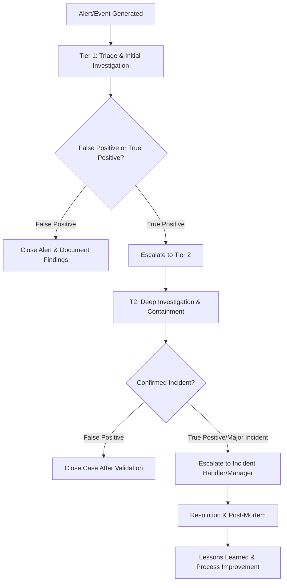

# Table of Contents
- [[#Introduction|Introduction]]
- [[#The SOC Alert Handling Workflow|The SOC Alert Handling Workflow]]
- [[#1 SOC Tier 1 T1 - The Front Line  The Triage Engine|1 SOC Tier 1 T1 - The Front Line  The Triage Engine]]
	  - [[#Key Responsibilities|Key Responsibilities]]
	  - [[#Mindset|Mindset]]
	  - [[#Real-World Example|Real-World Example]]
- [[#2 SOC Tier 2 T2 - The Incident Responder  The Hunter|2 SOC Tier 2 T2 - The Incident Responder  The Hunter]]
	  - [[#Key Responsibilities|Key Responsibilities]]
	  - [[#Mindset|Mindset]]
	  - [[#Real-World Example Continuing from T1|Real-World Example Continuing from T1]]
- [[#3 SOC Tier 3 T3 - The Expert  The Threat Hunter|3 SOC Tier 3 T3 - The Expert  The Threat Hunter]]
	  - [[#Key Responsibilities|Key Responsibilities]]
	  - [[#Mindset|Mindset]]
- [[#SOC Tier Responsibilities Summary Table|SOC Tier Responsibilities Summary Table]]
- [[#Action Plan: What You Need to Do|Action Plan: What You Need to Do]]

---

## Introduction

Understanding the distinct roles, responsibilities, and skill sets of each SOC tier so you can perform your own job (T1) effectively, know exactly when and why to escalate an alert, and see a clear path for your career growth.

---

## The SOC Alert Handling Workflow

Before diving into tier responsibilities, here's the complete workflow that governs every alert:

---

## 1. SOC Tier 1 (T1) - The Front Line / The Triage Engine

**Primary Mission:** **Volume and Velocity.** Monitor, triage, and perform initial investigation on a high volume of security alerts.

### Key Responsibilities:

- **Alert Acknowledgment:** Be the first set of eyes on alerts from the SIEM, EDR, IDS, and other tools.
- **Initial Triage:** Quickly determine if an alert is a **false positive**, a **true positive**, or requires more information.
- **Follow Playbooks:** Execute standardized procedures (playbooks) for common alert types.
    - Example: "Phishing Email Triage Playbook" - Check sender reputation, analyze email headers, verify links/attachments
    - Example: "Brute Force Alert Investigation" - Check if account locked, review failed login attempts, verify source IP
- **Basic Investigation:** Gather initial facts answering: "Who, What, When, Where?"
    - Check IP/Domain reputation (VirusTotal, AbuseIPDB, Threat Intel Feeds)
    - Look up file hashes in threat intelligence databases
    - Correlate basic logs in the SIEM (authentication logs, firewall logs, proxy logs)
- **Decision Making:**
    - If False Positive: Document reasoning clearly and close the ticket
    - If True Positive or Inconclusive: **Escalate to Tier 2** with clear, concise notes

### Mindset:

**Efficiency and Process.** Your goal is to clear the queue of noise so T2 can focus on real threats. You are the filter that protects the organization from alert fatigue.

### Real-World Example:

> You receive a SIEM alert: "Multiple Failed Login Attempts - User: jsmith"
> 
> Your T1 Investigation:
> 
> 1. Check the user account - Is jsmith a real user? (Yes, Marketing Manager)
> 2. Review the timeline - 50 failed attempts in 2 minutes from IP 203.0.113.45
> 3. Check IP reputation - Flagged as known brute force source in threat intel
> 4. Check if successful login occurred - Yes, after the 50th attempt from same IP
> 5. **Decision:** TRUE POSITIVE - Escalate to T2 with evidence gathered

---

## 2. SOC Tier 2 (T2) - The Incident Responder / The Hunter

**Primary Mission:** **Depth and Scope.** Perform deep-dive investigation on escalated alerts, confirm incidents, determine the scope of compromise, and begin containment.

### Key Responsibilities:

- **Deep-Dive Analysis:** Investigate alerts that T1 could not resolve
    - Advanced log analysis across multiple data sources
    - EDR telemetry review (process trees, network connections, file modifications)
    - Forensic artifact examination (registry keys, scheduled tasks, persistence mechanisms)
- **Scope Expansion:** Take a confirmed malicious indicator and hunt for it across the entire environment
    - Example: "This IP contacted one host - are there 50 more affected machines?"
    - Query SIEM for all connections to malicious IOCs
    - Search EDR for similar behavioral patterns
- **Incident Confirmation:** Officially declare a security incident based on evidence
- **Containment Actions:** Take immediate steps to stop threat spread
    - Isolate compromised hosts from the network
    - Disable compromised user accounts
    - Block malicious IPs/domains at the firewall
    - Quarantine malicious files via EDR
- **Mentorship:** Provide guidance and feedback to T1 analysts

### Mindset:

**Investigation and Correlation.** You're connecting the dots to understand the full story of an attack - not just identifying one bad thing, but understanding the entire attack chain.

### Real-World Example (Continuing from T1):

> T2 receives your escalation about jsmith's compromised account:
> 
> T2 Deep Investigation:
> 
> 1. Review all jsmith activity after successful login - accessed file shares, downloaded sensitive files
> 2. Check for lateral movement - attempted RDP connections to 5 other servers
> 3. Hunt for the attacker IP across environment - found connections to 3 other compromised accounts
> 4. Containment: Disable all 4 accounts, isolate affected hosts, block attacker IP at perimeter
> 5. **Decision:** Confirmed incident - Escalate to Incident Handler for coordinated response

---

## 3. SOC Tier 3 (T3) - The Expert / The Threat Hunter

**Primary Mission:** **Expertise and Proactivity.** Handle the most complex incidents, conduct proactive threat hunting, and improve the SOC's overall capabilities.

### Key Responsibilities:

- **Complex Incident Response:** Lead response for major breaches
    - Ransomware outbreaks requiring business continuity activation
    - Advanced Persistent Threats (APTs) with sophisticated tactics
    - Supply chain attacks affecting multiple systems
- **Threat Hunting:** Proactively search for hidden threats that bypassed automated detection
    - Hypothesis-driven investigations ("Are we vulnerable to X technique?")
    - Behavioral analysis looking for anomalies
    - Hunting based on new threat intelligence
- **Malware Analysis:** Reverse engineer malicious software
    - Static analysis (examining code without execution)
    - Dynamic analysis (running malware in sandbox environments)
    - Understanding attacker tools, techniques, and procedures
- **Tool & Rule Development:** Create advanced detection rules
    - Develop custom SIEM correlation rules
    - Create YARA rules for malware detection
    - Build automation scripts for repetitive tasks
- **Strategic Improvement:** Identify and address SOC capability gaps
    - Analyze metrics to find process bottlenecks
    - Recommend new security tools or technologies
    - Lead post-incident review sessions

### Mindset:

**Innovation and Mastery.** You are no longer just reacting; you are thinking like an adversary and building defenses against future attacks before they happen.

---

## SOC Tier Responsibilities Summary Table

|Phase|Primary T1 Role|Primary T2/T3 Role|
|---|---|---|
|**Preparation**|Learn tools & playbooks|Develop & improve playbooks|
|**Detection & Analysis**|**Initial Triage & Escalation**|Deep Dive, Scope, Confirm Incident|
|**Containment**|Supporting role (execute directed actions)|**Lead & Execute containment strategies**|
|**Eradication**|Not typically involved|**Root cause analysis & threat removal**|
|**Recovery**|Not typically involved|System restoration & validation|
|**Post-Incident**|**Provide triage feedback**|Lead analysis, write reports, tune detection rules|

---

## Action Plan: What You Need to Do

|Action Item|Description|Why It's Important|
|---|---|---|
|**1. Find Your SOC's Org Chart**|Ask your manager: "Is there a document that outlines our specific T1/T2/T3 roles and escalation paths?"|Your organization might have variations. Knowing exact expectations and escalation contacts is critical.|
|**2. Study Escalation Examples**|In your ticketing system, review 10 past tickets that were escalated from T1 to T2. Read the notes and comments.|Real-world learning - see what good (and bad) escalations look like in your environment.|
|**3. Practice the Handoff Checklist**|When escalating, use this mental checklist: ☐ All relevant IOCs provided (IPs, Hashes, Users) ☐ Summary of what I checked and found ☐ Clear statement of why I need T2's help|A clear handoff makes T2 more efficient and builds your professional reputation.|
|**4. Talk to a T2 Analyst**|During a quiet period, ask: "What is the one thing you wish every T1 would do when escalating?"|Direct feedback from the person receiving your escalations - invaluable insight.|
|**5. Daily Self-Assessment**|At shift end, ask yourself: • Did I close any tickets that should have been escalated? • Did I escalate any I could have solved? • What was my most challenging alert and why?|Reflective practice develops analytical judgment beyond just following steps.|

---

> **T1 Analyst Goal:** Master the T1 role of efficient triage and clear escalation. Your accurate initial assessment and thorough documentation directly impact the speed and effectiveness of the entire incident response process.

[[#Table of Contents|↑ Back to Top]]