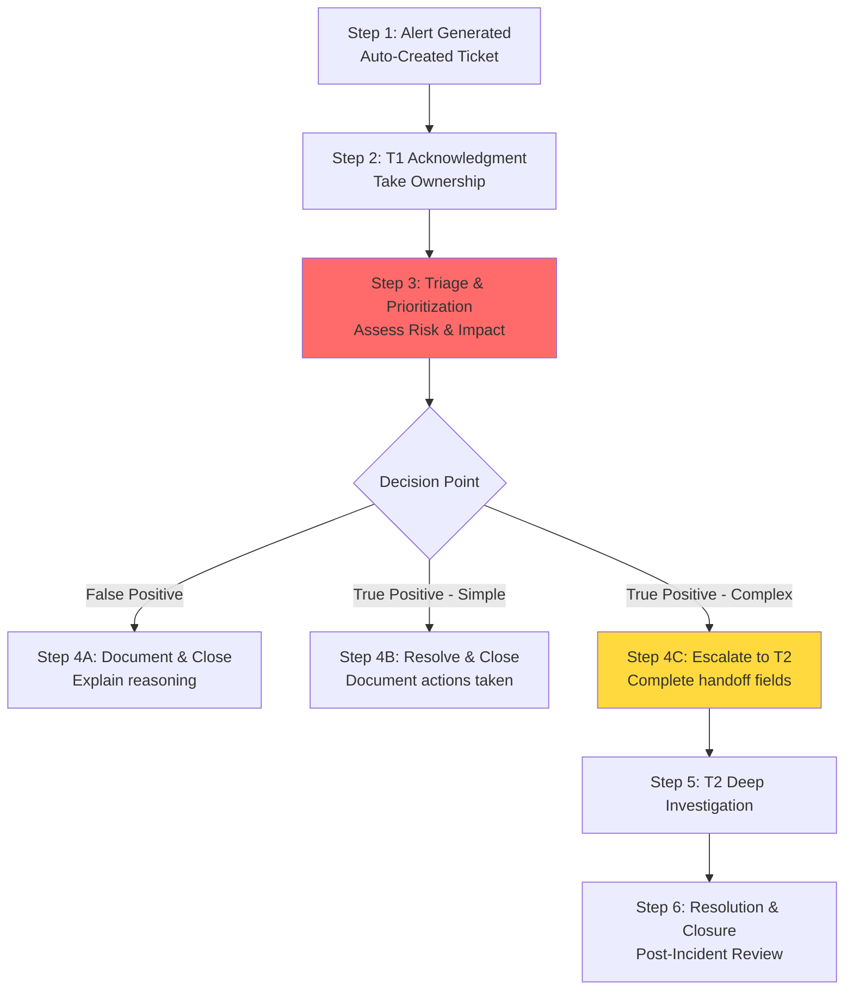

# Table of Contents
- [[#The Ticketing System|The Ticketing System]]
- [[#Why the Ticketing System is Critical for T1|Why the Ticketing System is Critical for T1]]
- [[#The Complete Ticketing Workflow|The Complete Ticketing Workflow]]
- [[#Step 1: Alert Generation & Ticket Creation|Step 1: Alert Generation & Ticket Creation]]
- [[#Step 2: Acknowledgment & Ownership|Step 2: Acknowledgment & Ownership]]
- [[#Step 3: Triage & Prioritization YOUR CRITICAL PHASE|Step 3: Triage & Prioritization YOUR CRITICAL PHASE]]
	  - [[#3A: Alert Validation|3A: Alert Validation]]
	  - [[#3B: Risk Assessment & Prioritization|3B: Risk Assessment & Prioritization]]
- [[#Step 4: Decision & Action|Step 4: Decision & Action]]
  - [[#Path A: False Positive - Close the Ticket|Path A: False Positive - Close the Ticket]]
  - [[#Path B: True Positive - Simple Resolution|Path B: True Positive - Simple Resolution]]
  - [[#Path C: True Positive - Escalation Required|Path C: True Positive - Escalation Required]]

---

## The Ticketing System

The Ticketing System (also called Case Management System) is not just a task tracker - it's the **official system of record** for all security incidents and your most important tool for accountability, workflow management, and communication with other SOC tiers.

---

## Why the Ticketing System is Critical for T1

Every action you take must be documented in the ticket. This system:

- **Governs your workflow** - from alert acknowledgment to closure or escalation
- **Tracks performance metrics** - MTTR and MTTD calculations start when you take ticket ownership
- **Serves as legal evidence** - maintains chain of custody for potential investigations or lawsuits
- **Enables communication** - your primary way to hand off work to T2 and document decisions

---

## The Complete Ticketing Workflow



---

## Step 1: Alert Generation & Ticket Creation

**What Happens:**

- Security tool (SIEM, EDR, IDS) detects suspicious activity
- Alert automatically generates a ticket in the system
- Ticket enters the **New/Unassigned** queue

**Critical Auto-Populated Fields:**

|Field|Source|Example Value|
|---|---|---|
|Alert Name|Detection Rule|"Multiple Failed Login Attempts"|
|Alert Timestamp|Security Tool|"2024-11-07 14:32:15 UTC"|
|Source System|Tool Integration|"Splunk SIEM"|
|Raw Data|Log Events|[Log entries that triggered the alert]|

**Your Action:** None yet - just be aware alerts are filling the queue

---

## Step 2: Acknowledgment & Ownership

**What Happens:**

- You select a ticket from the queue based on priority
- You click "Assign to Me" or "Acknowledge"
- **The MTTR clock starts ticking**

**Critical Fields You Update:**

|Field|Your Action|Why It Matters|
|---|---|---|
|**Status**|Change from "New" to "In Progress"|Shows ticket is being worked, prevents duplicate effort|
|**Assigned To**|Your name|Establishes accountability|
|**Acknowledged Time**|Auto-populated|Starts metric tracking for response time|

**Best Practice:** Don't let tickets sit in "New" status. Even if you're going to triage it in 30 minutes, acknowledge ownership immediately to show management the ticket is on someone's radar.

---

## Step 3: Triage & Prioritization (YOUR CRITICAL PHASE)

**What Happens:** This is where you perform your core T1 function - quickly assess the alert to determine if it's real, what the risk is, and what action to take.

### 3A: Alert Validation

**Your Tasks:**

1. **Verify the alert is real:** Check if the activity actually occurred (not a tool misconfiguration)
2. **Gather context:** Who is affected? What system? When did it happen?
3. **Enrich with threat intelligence:** Check IOCs against VirusTotal, AbuseIPDB, internal threat feeds
4. **Follow the playbook:** Execute the standard investigation steps for this alert type

**Real Example - Phishing Email Alert:**

```
Alert: "Suspicious Email Detected - Possible Phishing"
Affected User: jane.doe@company.com
Email Subject: "Urgent: Update Your Password"

Your Triage Steps:
1. Check email headers - Sender domain: fake-it-security.com (not company domain)
2. Check URL in email - Link points to credential harvesting site (VirusTotal: 45/70 engines flagged)
3. Check if user clicked link - Proxy logs show NO connection to malicious URL
4. Check if other users received same email - SIEM query shows 50 other recipients

Decision: TRUE POSITIVE - Phishing campaign affecting 50 users
```

### 3B: Risk Assessment & Prioritization

**Your Tasks:** Assign appropriate **Priority/Severity** based on:

- **Business Impact:** What's affected? (Critical server vs. test workstation)
- **Data Sensitivity:** Is sensitive data at risk? (PII, financial data, trade secrets)
- **Scope:** How many systems/users affected?
- **Active Attack:** Is the attack ongoing or historical?

**Priority Levels:**

|Priority|When to Use|Response SLA|Example|
|---|---|---|---|
|**P1 - Critical**|Active attack on critical systems, data breach in progress, widespread impact|Immediate response required|Ransomware encrypting file servers RIGHT NOW|
|**P2 - High**|Confirmed compromise, limited scope, high-value target affected|Response within 1 hour|Single executive workstation compromised with malware|
|**P3 - Medium**|Suspicious activity requiring investigation, policy violations|Response within 4 hours|Failed login attempts from unusual location|
|**P4 - Low**|Informational alerts, low-risk policy violations|Response within 24 hours|Software installation on non-critical test system|

**Critical Fields You Update:**

|Field|What to Enter|Example|
|---|---|---|
|**Priority/Severity**|P1, P2, P3, or P4|P2 - High|
|**Affected Asset**|Hostname or IP|DESKTOP-12345 / 10.50.100.25|
|**Affected User**|Username|jsmith|
|**Initial Assessment**|Your findings summary|"Confirmed malware detection. VirusTotal 45/70 engines flagged. Host isolated via EDR."|

---

## Step 4: Decision & Action

Based on your triage, you take one of three paths:

### Path A: False Positive - Close the Ticket

**When to Use:**

- Alert was triggered by legitimate activity
- Tool misconfiguration or tuning issue
- Known false positive pattern

**Critical Fields You MUST Complete:**

|Field|What to Document|Example|
|---|---|---|
|**Resolution Notes**|Clear explanation of why it's false positive|"Alert triggered by automated backup job. Source IP confirmed as internal backup server 10.10.1.50. Verified via backup schedule - runs daily at 02:00 UTC. No malicious activity detected."|
|**Root Cause**|Why the alert fired|"SIEM rule needs tuning to exclude backup server IPs"|
|**Status**|"Closed - False Positive"||
|**Closure Time**|Auto-populated|Stops MTTR clock|

**Real Example:**

```
Alert: "Large Data Transfer to External IP"
Initial Finding: 500GB uploaded to IP 203.0.113.50
Investigation: 
- IP 203.0.113.50 = Company's cloud backup provider (verified in asset database)
- Transfer time matches scheduled backup window
- User account =
```

[[#Table of Contents|↑ Back to Top]]